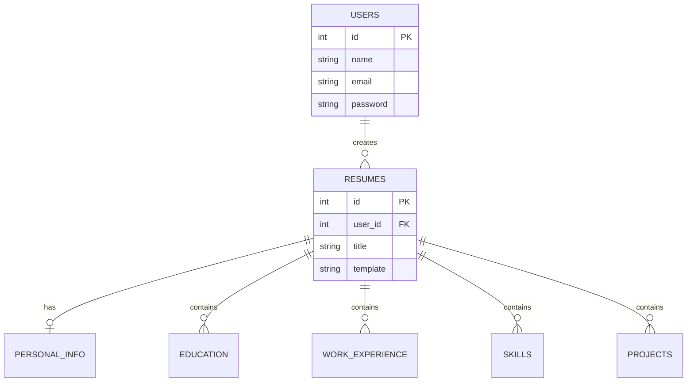

# System Architecture & Technical Documentation

This document provides a deep dive into the architecture, design decisions, and data flow of the Resume Builder application. It is intended to help developers understand how the frontend and backend communicate and how the system is structured.

## 1. High-Level Architecture

The project utilizes a **Decoupled Monolith / Client-Server Architecture**. 

- **Frontend:** A standalone React/Next.js application responsible entirely for the User Interface, state management, and PDF rendering.
- **Backend:** A standalone PHP REST API responsible for data validation, database persistence, authentication, and serving raw JSON data.
- **Communication:** The frontend communicates with the backend exclusively via HTTP REST endpoints using standard JSON payloads.

```mermaid
graph TD;
    Client[Browser / User] -->|HTTP Requests| NextJS[Next.js Frontend]
    NextJS -->|REST API (JSON, Tokens)| PHP_API[PHP Backend API]
    PHP_API -->|PDO Queries| MySQL[(MySQL Database)]
    NextJS -->|Client-Side PDF Gen| html2pdf[html2pdf.js]
```

## 2. Frontend Architecture (Next.js)

### Core Technologies
- **Next.js 16:** Utilizes the App Router paradigm (`app/` directory).
- **Context API:** Global state management is handled natively with React Context to avoid over-engineering with external libraries like Redux.
- **Tailwind CSS v4:** Used for utility-first styling and rapid UI development.

### State Management
State is logically divided into context providers:
1. `AuthContext.js`: Manages user sessions, login/signup logic, JWT storage in `localStorage`, and handles HTTP interception for unauthorized responses.
2. `ResumeContext.js`: The central hub for the builder. It holds the active resume object, handles real-time updates as the user types, and manages the synchronization of data to the backend.

### The Builder Workflow
The `app/builder` route is the core of the frontend. It operates in a split-screen view:
1. **Left Pane (Form Inputs):** Renders dynamic form components from `components/forms/`. As inputs change, they dispatch updates to the `ResumeContext`.
2. **Right Pane (Preview):** Renders the `components/resume/ResumePreview` component. This component reacts instantly to `ResumeContext` changes, providing real-time visual feedback using the selected template structure (`components/templates/`).

### Client-Side PDF Generation
To reduce server load and complexity, PDF generation is offloaded to the client using `html2pdf.js` (`utils/pdfExport.js`). The DOM node of the live preview is captured, scaled, and converted to a PDF locally.

## 3. Backend Architecture (PHP)

### Core Design Philosophy
The backend is built in **Pure PHP** (no Laravel, Symfony, etc.) to demonstrate a deep understanding of core web concepts, routing, and HTTP headers without relying on abstraction magic.

### Directory Structure & Responsibilities
- `api/`: Acts as the routing layer. Individual PHP files map to specific endpoints (e.g., `api/user/login.php` maps to `/user/login.php`). They receive the HTTP request, parse the JSON, and call the models.
- `models/`: Contains Data Access Objects (DAOs). Each model (e.g., `User.php`, `Resume.php`, `Education.php`) encapsulates the database queries required for that entity. 
- `config/db.php`: Establishes the PDO database connection singleton.
- `helpers/`: Reusable utilities such as `response.php` for formatting standardized JSON responses and checking HTTP headers.

### Security Implementation
- **Authentication:** Token-based. The client receives a token upon login and sends it via the `Authorization` header on subsequent requests.
- **Database Security:** 100% of database queries are executed using **PDO Prepared Statements**, making SQL injection practically impossible.
- **Password Security:** Passwords are hashed using the bcrypt algorithm via `password_hash()` and verified using `password_verify()`.

## 4. Data Model (Entity Relationship)

The database is highly relational, centralizing around the `Resumes` table.



- **Cascade Deletion:** Properly configured foreign keys ensure that if a user deletes a resume, all associated education, experience, and skill records are automatically removed.

## 5. Development & Deployment Considerations

### CORS (Cross-Origin Resource Sharing)
Since the frontend and backend run on different ports (or domains in production), the PHP backend explicitly sets CORS headers to permit Next.js to communicate with it.
```php
header("Access-Control-Allow-Origin: *"); // Or specific frontend domain
header("Access-Control-Allow-Methods: POST, GET, OPTIONS, PUT, DELETE");
header("Access-Control-Allow-Headers: Content-Type, Authorization");
```

### Production Deployment
1. **Frontend:** Can be seamlessly deployed to Vercel, Netlify, or any static hosting that supports Next.js.
2. **Backend:** Requires a standard LAMP/LEMP stack (Linux, Apache/Nginx, MySQL, PHP). The `src/` folder should be served as the document root, and `.htaccess` or Nginx configs should be used to protect sensitive directories like `config/` or `models/` from direct web access.
